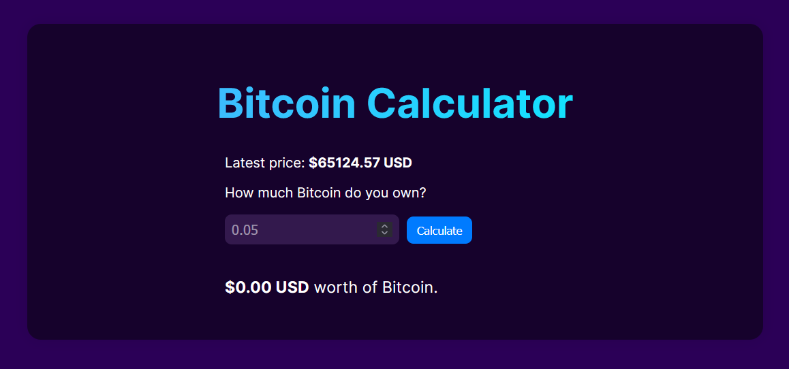

# Bitcoin to USD Converter



Welcome to the Bitcoin to USD Converter project! This repository contains the code for a simple yet functional web application that allows users to convert Bitcoin (BTC) to US Dollars (USD) in real-time.
Project Overview

In this project, you'll gain hands-on experience with:

- API Fetching: Learn how to fetch real-time data from a cryptocurrency API to get the current Bitcoin to USD exchange rate.
- DOM Manipulation: Understand how to dynamically update the HTML and CSS based on user inputs and API responses.
- LocalStorage: Store and retrieve user preferences or previous conversion data using the browser's localStorage.
- Basic Math: Perform simple arithmetic operations to calculate the conversion amount based on the exchange rate.

## Technologies Used

- HTML: Structuring the web page.
- CSS: Styling the application for a better user experience.
- JavaScript: Implementing the logic for fetching data, updating the DOM, and storing information in localStorage.

## Features

- Real-time Conversion: Get the latest Bitcoin to USD exchange rate using a cryptocurrency API.
- User-friendly Interface: Simple and intuitive UI for easy conversion.
- Persistent Data: Save user preferences or previous conversions in localStorage for convenience.

## Getting Started

To get started with the project, clone this repository and open the index.html file in your browser.

```
git clone https://github.com/Voxold/Bitcoin-Calculator
```
```
cd Bitcoin-Calculator
```
## Usage

- Open the index.html file in your browser.
- Enter the amount of Bitcoin you want to convert.
- The equivalent amount in USD will be displayed instantly based on the current exchange rate.

## Contribution

Feel free to fork this repository, submit issues, and send pull requests. Your contributions are always welcome!
